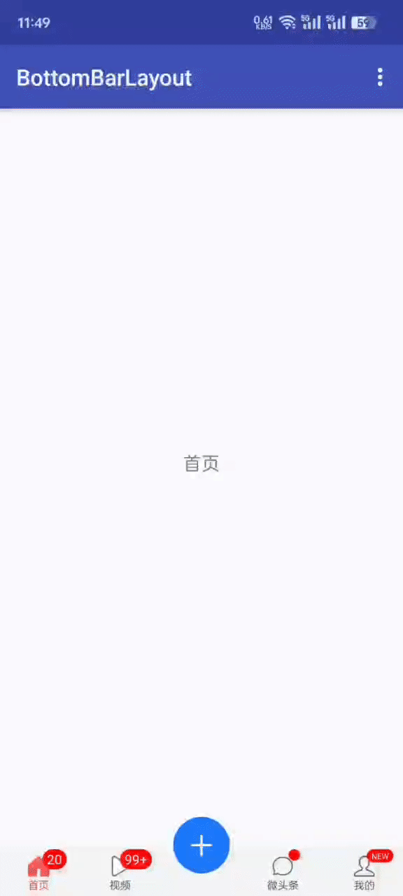
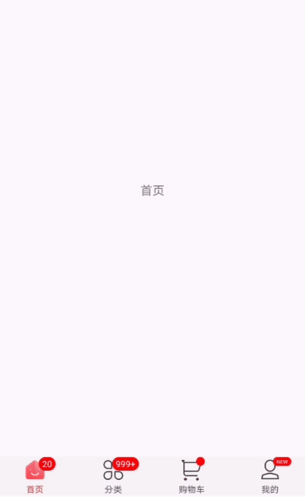

[中文(Chinese)](https://github.com/chaychan/BottomBarLayout)

### Support

If you feel that my project is helpful to you, please help me to click on the **star** and let more people see it. Thank you!

### Version 3.0

The new version 3.0 has refactored the project, and the usage is very different. If you used version 2.0 before, please refer to [BottomBarLayout-2.1.0](https://github.com/chaychan/BottomBarLayout/blob/master/README-en-2.0.md) for detailed usage if you want to continue to update and maintain it. The old version will no longer be maintained. If necessary, please download the source code and modify it. The branch name is feature-2.1.0

### Introduction
Currently, App on the market almost has a navigation bar at the bottom, so we often need to use this during development. Although there are many tools on the github packaged bottom navigation bar, such as bottombar, alphaIndicator Swipe gradient bottom controls etc., but these controls are not particularly easy to use due to too many functions and no detailed documentation. Sometimes we just want a simple bottom navigation, but we don't want to go One by one in the layout of the LinearLayout or RadioGroup, and then change the tab icon, let ViewPager jump to the corresponding page and a series of tedious operations, this time, you can use BottomBarLayout, simply can achieve the following effect:

#### Apk

[click to download](https://raw.githubusercontent.com/chaychan/BottomBarLayout/master/apk/demo.apk)

or scan the QR code


#### **How to import**

Add the jitpack repository address in allprojects{} in build.gradle in the project root directory, as follows：
```
allprojects {
  repositories {
    jcenter()
    maven { url 'https://jitpack.io' }//Add jitpack
  }
}
 ```
Open the build.gradle in the app's module, add dependencies in dependencies {} as follows:
```
 dependencies {
    implementation 'com.github.chaychan:BottomBarLayout:3.0.0' //It is recommended to use the latest version
 }
```

The latest version can be viewed

[https://github.com/chaychan/BottomBarLayout/releases](https://github.com/chaychan/BottomBarLayout/releases)

### Demo

#### Supports raising the middle icon and intercepting before clicking


#### Display unread, show red dot, display message


#### Support to use lottie



#### Historical version update notes

[Historical version update notes](https://github.com/chaychan/BottomBarLayout/blob/master/update-note-en.md)

### Usage

#### Attribute introduction
```
    <!--Set the height of the bar-->
    <attr name="barHeight" format="dimension"/>
    <!--Set the background of the bar-->
    <attr name="barBackground" format="reference"/>
    
    <!--Whether the middle icon is raised-->
    <attr name="floatEnable" format="boolean"/>
    <!--Set the distance between the raised button and the bottom-->
    <attr name="floatMarginBottom" format="dimension"/>
    
    <!--Float icon-->
    <attr name="floatIcon" format="reference"/>
    <!--Width of the float icon-->
    <attr name="floatIconWidth" format="dimension"/>
    <!--Height of the float icon-->
    <attr name="floatIconHeight" format="dimension"/>
    
    <!--Whether to enable the sliding of viewPager-->
    <attr name="smoothScroll" format="boolean"/>
    <!--Same tab click callback-->
    <attr name="sameTabClickCallBack" format="boolean"/>
    
    <!--Text size-->
    <attr name="itemTextSize" format="dimension"/>
    <!--Text bold-->
    <attr name="itemTextBold" format="boolean"/>
    <!--Text color in default state-->
    <attr name="textColorNormal" format="color"/>
    <!--Text color in selected state-->
    <attr name="textColorSelected" format="color"/>
    
    <!--Top distance between text and icon-->
    <attr name="itemMarginTop" format="dimension"/>
    
    <!--Set icon width-->
    <attr name="iconWidth" format="dimension"/>
    <!--Set icon height-->
    <attr name="iconHeight" format="dimension"/>
    
    <!--Set the padding of BottomBarItem-->
    <attr name="itemPadding" format="dimension"/>
    
    <!--Set the font size of unread text-->
    <attr name="unreadTextSize" format="dimension"/>
    <!--Set the font color of unread text-->
    <attr name="unreadTextColor" format="reference"/>
    <!--Set the background color of unread text-->
    <attr name="unreadTextBg" format="reference"/>
    
    <!--Set the font size of prompt message-->
    <attr name="msgTextSize" format="dimension"/>
    <!--Set the font color of prompt message-->
    <attr name="msgTextColor" format="reference"/>
    <!--Set the background of prompt message-->
    <attr name="msgTextBg" format="reference"/>
    
    <!--Set the background of prompt point-->
    <attr name="notifyPointBg" format="reference"/>
    
    <!--Set the unread array threshold. Numbers greater than the threshold will be displayed as n+n is the set threshold-->
    <attr name="unreadThreshold" format="integer"/>
```

#### Configuration in the layout file

In the xml file, configure BottomBarLayout to wrap the sub-item BottomBarItem

```
  <?xml version="1.0" encoding="utf-8"?>
  <LinearLayout
        xmlns:android="http://schemas.android.com/apk/res/android"
        xmlns:app="http://schemas.android.com/apk/res-auto"
        android:layout_width="match_parent"
        android:layout_height="match_parent"
        android:orientation="vertical">

    <androidx.viewpager2.widget.ViewPager2
        android:id="@+id/vp_content"
        android:layout_width="match_parent"
        android:layout_height="0dp"
        android:layout_weight="1"/>

    <com.chaychan.library.BottomBarLayout
        android:id="@+id/bbl"
        android:layout_width="match_parent"
        android:layout_height="wrap_content"
        app:barBackground="@color/tab_gb"
        app:barHeight="45dp"
        app:textColorNormal="@color/tab_normal_color"
        app:textColorSelected="@color/tab_selected_color"
        app:iconHeight="30dp"
        app:iconWidth="30dp"
        app:itemTextSize="8sp"
        app:itemMarginTop="-5dp"
        app:unreadTextSize="10sp"
        app:msgTextSize="6sp"/>

  </LinearLayout>
```

#### Java file settings

Find the corresponding ViewPager2 and BottomBarLayout, set Adapter for ViewPager2, and then set the ViewPager2 for BottomBarLayout
```
     protected List<TabData> getTabData() {
        List<TabData>  tabData = new ArrayList<>();
        tabData.add(new TabData("首页", R.mipmap.tab_home_normal, R.mipmap.tab_home_selected));
        tabData.add(new TabData("视频", R.mipmap.tab_video_normal, R.mipmap.tab_video_selected));
        tabData.add(new TabData("微头条", R.mipmap.tab_micro_normal, R.mipmap.tab_micro_selected));
        tabData.add(new TabData("我的", R.mipmap.tab_me_normal, R.mipmap.tab_me_selected));
        
        //If it is lottie.  The lottie file storage location: /src/main/assets
        //tabData.add(new TabData("首页", "home.json"));
        //tabData.add(new TabData("分类", "category.json"));
        //tabData.add(new TabData("购物车", "cart.json"));
        //tabData.add(new TabData("我的",  "mine.json"));
        
        return tabData;
    }
  
     ...
     mBottomBarLayout.setData(tabData); //Setting up the data source    
	 mVpContent.setAdapter(new MyAdapter(getSupportFragmentManager()));
     mBottomBarLayout.setViewPager2(mVpContent);
```

This realizes the bottom navigation bar function

#### Set the middle icon to be raised
```
<?xml version="1.0" encoding="utf-8"?>
<FrameLayout
    xmlns:android="http://schemas.android.com/apk/res/android"
    xmlns:app="http://schemas.android.com/apk/res-auto"
    android:layout_width="match_parent"
    android:layout_height="match_parent">

    <androidx.viewpager2.widget.ViewPager2
        android:id="@+id/vp_content"
        android:layout_width="match_parent"
        android:layout_height="match_parent"
        android:layout_marginBottom="45dp"/>

    <com.chaychan.library.BottomBarLayout
        android:id="@+id/bbl"
        android:layout_width="match_parent"
        android:layout_height="wrap_content" //Height needs to be adaptive
        android:layout_gravity="bottom"
        app:barBackground="@color/tab_gb"
        app:barHeight="45dp" //Specific height of the navigation bar
        app:floatEnable="true" //Whether to enable image bulge
        app:floatIcon="@mipmap/icon_add" //Raised icon resources
        app:floatIconWidth="50dp" //Raised icon width
        app:floatIconHeight="50dp" //Raised icon height
        app:floatMarginBottom="20dp" //Raised icon position from the bottom
        app:barBackground="@color/tab_gb"
        app:barHeight="45dp"
        app:floatEnable="true"
        app:floatIcon="@mipmap/icon_add"
        app:floatIconWidth="50dp"
        app:floatIconHeight="50dp"
        app:floatMarginBottom="20dp"
        app:textColorNormal="@color/tab_normal_color"
        app:textColorSelected="@color/tab_selected_color"
        app:iconHeight="30dp"
        app:iconWidth="30dp"
        app:itemTextSize="8sp"
        app:itemMarginTop="-5dp"
        app:unreadTextSize="10sp"
        app:msgTextSize="6sp"/>

</FrameLayout>
```


#### Add item dynamically

```
     for (int i = 0; i < mTitleIds.length; i++) {
            //create item
            BottomBarItem item = createBottomBarItem(i);
            mBottomBarLayout.addItem(item); //addItem

            TabFragment homeFragment = createFragment(mTitleIds[i]);
            mFragmentList.add(homeFragment);
    }


	 private BottomBarItem createBottomBarItem(int i) {
        BottomBarItem item = new BottomBarItem.Builder(this)
                .titleTextSize(8)
                .titleNormalColor(R.color.tab_normal_color)
                .titleSelectedColor(R.color.tab_selected_color)
	//          .marginTop(5)
	//          .itemPadding(5)
	//          .unreadNumThreshold(99)
	//          .unreadTextColor(R.color.white)

                //There are still many properties, please see the methods in the Builder for details.
                .create(mNormalIconIds[i], mSelectedIconIds[i], getString(mTitleIds[i]));
        return item;
    }
```

#### Remove item
```
     mBottomBarLayout.removeItem(0);
```
#### Turn on the slide effect

Tab switch between the closure of the default sliding effect, if you need to open the setSmoothScroll () method can be called by calling BottomBarLayout:
```
    mBottomBarLayout.setSmoothScroll(true);
```
You can also specify BottomBarLayout's smoothScroll property to be true in the layout file.

The effect after opening is as follows:


#### Intercept before jump
```
    mBottomBarLayout.setOnPageChangedIntercepagetor(position -> {
        boolean isLogin = false; //Simulate no login
        if (position == TAB_POSITION_ME && !isLogin){
            //no login intercept  to other tab or to LoginActivity
            Toast.makeText(ViewPager2DemoActivity.this, "Test intercept, Login first please", Toast.LENGTH_SHORT).show();
            return true;
        }
        return false; 
  });
```

#### Set the item selected listener
```
    mBottomBarLayout.setOnItemSelectedListener((bottomBarItem, previousPosition, currentPosition) -> {
         //do something
    });
```

#### Set whether to call back setOnItemSelectedListener when clicking the same tab repeatedly
```
  app:sameTabClickCallBack="true" //Defaults to false
```

#### Display unread, show red dot, display message
```
	mBottomBarLayout.setUnread(0,20);//Set the first tab's unread 20
    mBottomBarLayout.setUnread(1,101);//Set the first tab's unread 101
    mBottomBarLayout.showNotify(2);//The third page shows the tips of the little red dot
    mBottomBarLayout.setMsg(3,"NEW");//The fourth tab shows the NEW text
```
When the setting of unread less than or equal to 0, the disappearance of small red dot will disappear;
When the unread count is 1-99, the corresponding number is displayed. 
When unread more than 99, it shows 99+; 

#### Set unaware reading threshold
&emsp;&emsp; The unread threshold may specify the BottomBarItem's unreadThreshold property setting, which defaults to 99. For example, if app:unreadThreshold="999" is set, if the reading does not exceed this value, "999+" is displayed。

#### Hidden tips red dot, tips message
```
	mBottomBarLayout.hideNotify(2);//Hide the third page shows the tips of the little red dot
    mBottomBarLayout.hideMsg(3);//Hide the text displayed on the fourth tab
```
#### Set unread font color
```   
    app:unreadTextColor="@color/unreadTextColor"
```
#### Set the unread background
```
    app:unreadTextBg="@drawable/shape_unread"
```
Drawable is written as follows:
```
    <?xml version="1.0" encoding="utf-8"?>
	<shape xmlns:android="http://schemas.android.com/apk/res/android">
	    <corners android:radius="20dp" />
	    <solid android:color="@color/red" />
	    <padding android:left="4dp" android:right="4dp" android:top="1dp" android:bottom="1dp"/>
	</shape>
```
#### Set prompt text font color, background
```
     app:msgTextColor="@color/msgTextColor"
     app:msgTextBg="@drawable/shape_msg"
```
#### Set prompt point background
```
	 app:notifyPointBg="@drawable/shape_notify_point"
```


Well, here's the introduction of BottomBarLayout stop here, the reason for the package this control is mainly for the convenience of development, hope to help more people, if you have any ideas or comments may wish to put forward to me, I will continue to improve BottomBarLayout of.


#### Support and encouragement

If you think my project is helpful to you, star! So I will be more motivated to improve this project.


